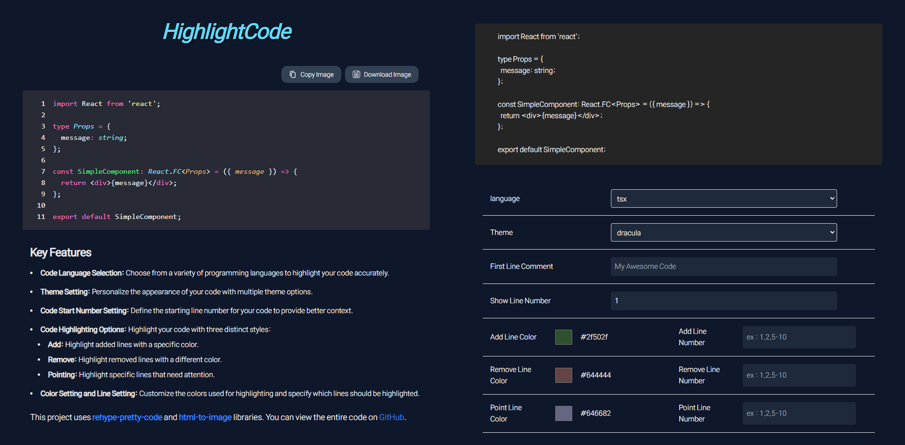
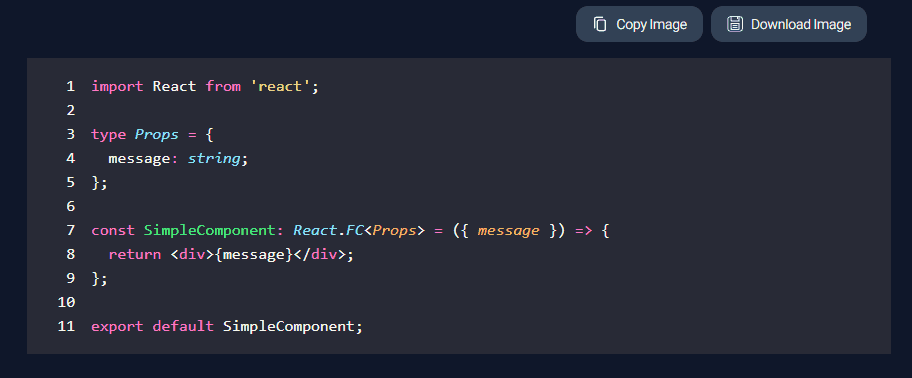
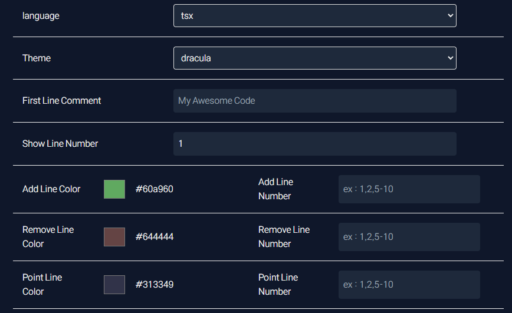
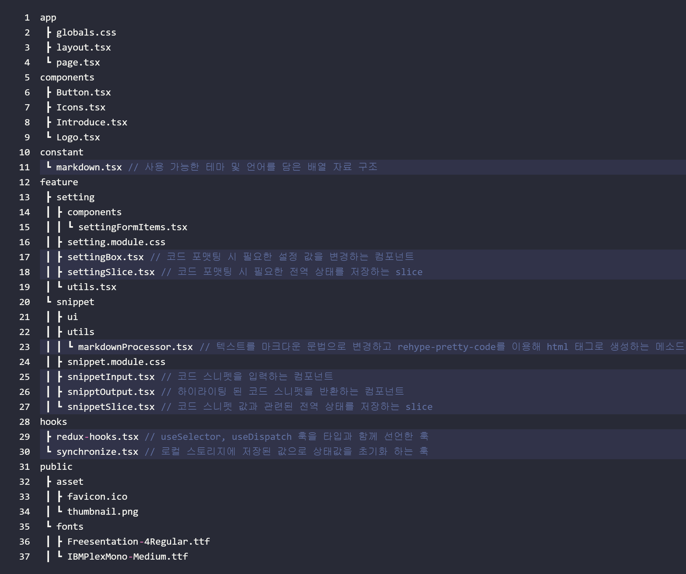
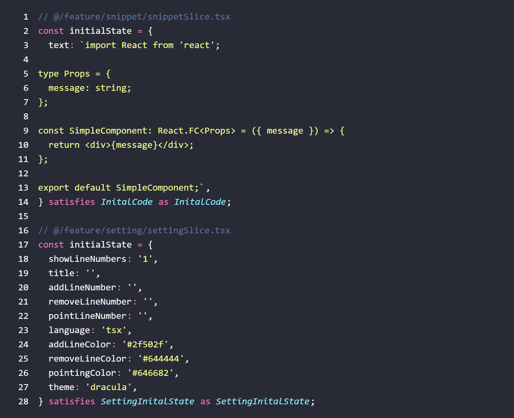
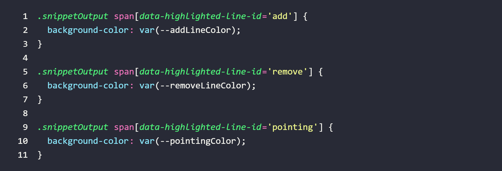
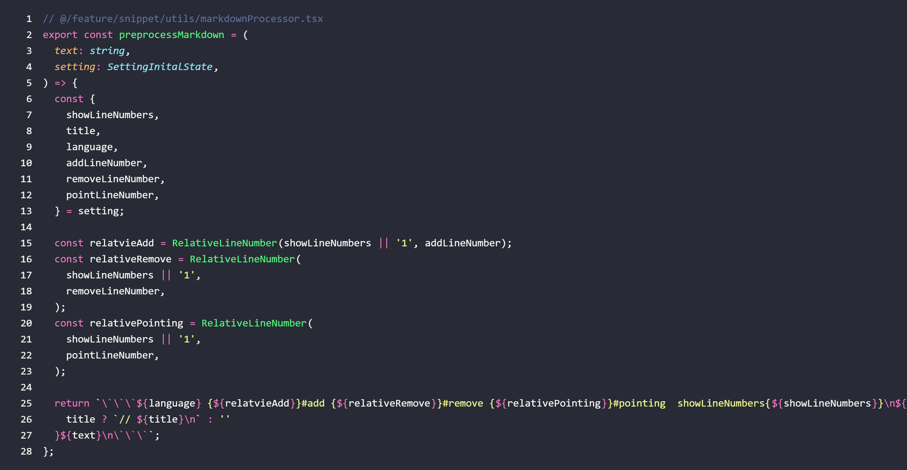
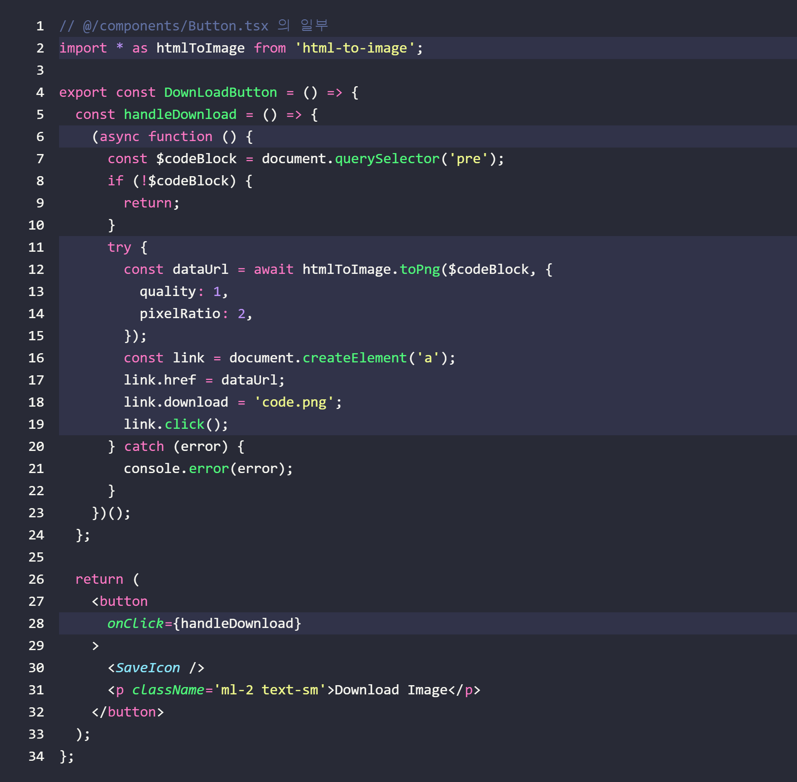

# HighlightCode


`HighlightCode.site` 는 텍스트 포맷으로 된 코드를 다음과 같은 기능들이 존재하는 이미지 파일로 저장하거나 클립 보드에 복사 가능하게 해주는 사이트입니다.

- 코드 포맷팅 언어 설정
- 테마 설정
- 코드 시작 번호 설정
- 코드 번호에 따른 추가 , 삭제 , 포인트 줄 하이라이팅

# Introduction

문서 작성을 하거나 블로깅을 할 때 코드 스니펫을 이쁘게 표현 하고 싶다는 생각이 자주 들곤 합니다.

코드 스니펫을 표현하기 위해 기본적인 마크다운 문법을 사용하거나 이미지로 변환해주는 사이트나 익스텐션들을 사용 할 수 있습니다.

하지만 흐름에 맞게 코드 번호를 커스터마이징 하거나 특정 줄들에 추가,삭제,포인트 색상을 주는 기능은 존재하지 않았습니다.

`HighlightCode` 는 다양한 커스터마이징을 제공하여 감각적인 코드 스니펫을 복사하거나 저장 할 수 있도록 해줍니다.

> ### 개발 소요 시간
>
> 2024-07-09 ~ 2024-07-12

# Usage



사용 방법은 코드 블록을 텍스트로 입력 한 후 다음과 같은 값들을 설정해주면 됩니다.

- `language` : 코드 포맷팅에 사용 할 언어 종류
- `Theme` : `rehype-pretty-code` 에서 제공하는 번들 테마 중 하나 선택
- `First Line Comment (optional)` : 첫 번째 줄에 들어갈 주석을 입력해줄 수 있습니다. 입력된 값은 자동으로 `//` 와 함께 작성 됩니다.
- `Show Line Number (optional)` : 코드 블록의 시작 번호를 작성합니다. 기본 값은 `1` 입니다.
- `Color` : 하이라이팅 시 적용 될 색상들을 선택합니다. 테마에 맞춰 커스터마이징 해보세요 :)
- `Line Number (optional)` : 하이라이팅 될 코드 번호들을 선택합니다. 번호를 하나씩 작성하거나 `-` 를 이용해 시작지점과 종료 지점을 선택 할 수 있습니다. 번호는 모두 `Show Line Number` 에 작성 된 번호를 기준으로 한 상대 번호로 적용 됩니다.

# 전체적인 파일 구조



전체적인 파일 구조는 기능에 따라 코드 하이라이팅에 필요한 마크다운 문법과 관련된 `setting` , 코드 스니펫 입력값과 하이라이팅 된 코드 스니펫과 관련된 `snippet` 폴더를 기준으로 이뤄져있습니다.

# Features

각 상태값을 담고 있는 `slice` 들이 가지고 있는 값들의 초기 상태 값들은 다음과 같습니다.



## 코드 포맷팅 기능


코드 포맷팅 기능은 단순한 `textarea` 로 이뤄진 `SnippetInput` 에 입력된 입력 값을 마크다운 문법으로 변환 후

`rehype-pretty-code` 를 통해 포맷팅 된 `html` 태그로 변환 후 `SnippetOutput` 에게 전달해 렌더링 합니다.

> `rehype-pretty-code` 는 마크다운 문법으로 이뤄진 코드 스니펫을 메타 문자를 이용해 언어에 맞춰 `pre , code , span[data-line] , span` 태그로 이뤄진 `html` 태그로 반환합니다.
>
> 이 때 테마에 따른 배경색이나 단어 별 색상은 인라인 스타일에 적용되어 반환 합니다.

## 코드 하이라이팅 기능


코드 하이라이팅은 `SettingReducer` 를 통해 값을 변경하고 , 변경된 값을 `SnippetOutput` 에게 전달합니다.

이 때 `rehype-pretty-code` 가 인식 가능한 마크다운 문법이란 다음을 뜻합니다.

````dotnetcli
```tsx {1}pointing, {2}#add , {3}#remove
const a = 1;
const b = 2;
const c = 3;
```
````

다음과 같이 마크다운 블록 위에 `{lineNumber}` 와 함께 스타일링에 사용 할 `#id` 를 작성해주면 `rehype-pretty-code` 는 포맷팅 된 코드 줄에 `data-highlighted-line-id="id"` 와 같은 커스텀 어트리뷰트를 추가하여 `html` 태그로 변환해줍니다.



이후 `css` 를 통해 해당 어트리뷰트를 가지고 있는 `span` 태그에 배경 색을 루트에 지정해둔 `css variable` 들로 배경색을 적용해줘 하이라이팅을 해주었습니다.

> 만약 하이라이팅 색상 변경 이벤트가 발생하면 직접 `css variable` 의 값을 변경해줘 하이라이팅 색상을 커스터마이징 하는 것이 가능합니다.



이 때 `First Line Comment` 에 입력 값이 있는 경우 첫 번째 줄에 주석을 달 수 있게 하고 `{lineNumber}` 의 경우엔 코드 시작 번호를 기준으로 하여 상대적으로 작성 할 수 있도록 전처리 해주었습니다.

`snippetOutput` 컴포넌트는 `settingReducer, snippetReducer` 의 상태를 모두 받아 `rehype-pretty-code` 가 인식 가능한 마크다운 문법으로 전처리하고 `html` 태그를 받아 렌더링 합니다.

## 코드 번호 설정

사실 `rehype-pretty-code` 에선 메타 문자로 `showLineNumbers{startNumber}` 를 적어주면 `span[data-line]::before` 가상 선택자를 이용해 코드 번호를 작성해줍니다.

하지만 가상 선택자를 이용한 코드 번호는 이미지 파일로 변환 할 때 인식이 되지 않아 코드 포맷팅이 된 `Actual DOM` 에 직접 접근하여 `settingReducer.showLineNumber`값을 이용해 코드 번호들을 나타내는 태그를 삽입해줬습니다.

## html 태그를 이미지로 저장 및 복사

`html` 태그를 이미지로 저장하거나 복사하는 기능은 `html-to-image` 라이브러리를 이용해주었습니다.



다운로드 버튼을 누르면 다음과 같이 하이라이팅이 된 코드 스니펫을 `png` 파일로 변환 후 저장합니다.

# License

```dotnetcli
MIT License

Permission is hereby granted, free of charge, to any person obtaining a copy of this software and associated documentation files (the "Software"), to deal in the Software without restriction, including without limitation the rights to use, copy, modify, merge, publish, distribute, sublicense, and/or sell copies of the Software, and to permit persons to whom the Software is furnished to do so, subject to the following conditions:

The above copyright notice and this permission notice shall be included in all copies or substantial portions of the Software.

THE SOFTWARE IS PROVIDED "AS IS", WITHOUT WARRANTY OF ANY KIND, EXPRESS OR IMPLIED, INCLUDING BUT NOT LIMITED TO THE WARRANTIES OF MERCHANTABILITY, FITNESS FOR A PARTICULAR PURPOSE AND NONINFRINGEMENT. IN NO EVENT SHALL THE AUTHORS OR COPYRIGHT HOLDERS BE LIABLE FOR ANY CLAIM, DAMAGES OR OTHER LIABILITY, WHETHER IN
```

해당 프로젝트는 누구나 사용 및 수정이 가능합니다.
